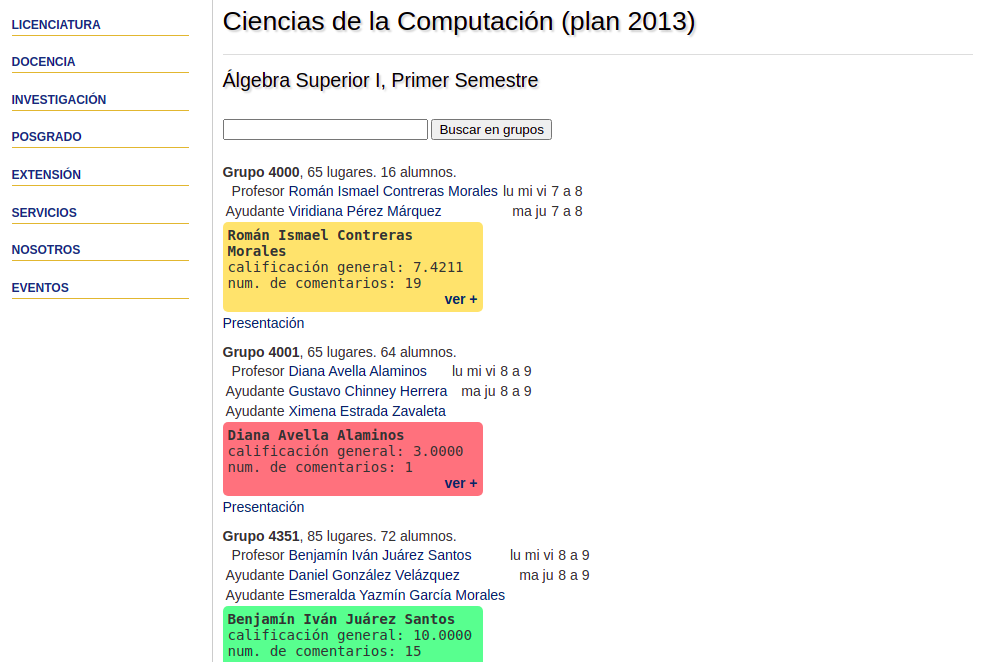

# Extensión de Chrome FCiencias

[Página en chrome store](https://chrome.google.com/webstore/detail/fciencias-x-misprofesores/dohpejgohngelepkpjhabhclphponoed)

Extensión de chrome para ver las calificaciones de tus profes desde la página de la facultad.
La extensión monitorea los URLs de las tabs de chrome y al identificar que estás en la página de alguna materia de fciencias hace un fetch request a misprofesores.com, parsea la info recibida con regex e inyecta HTML y CSS de la información de los profesores a la página.

